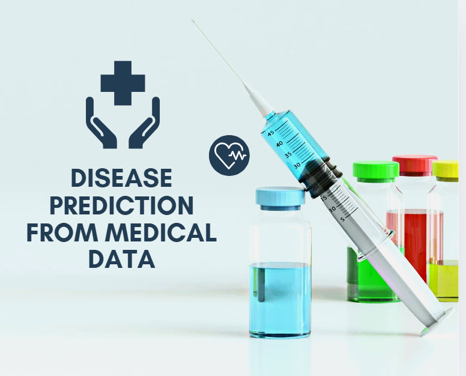

# codealpha_Disease_Prediction_from_Medical_Data

The Disease Prediction from Medical Data project aims to predict the risk of diabetes using health indicators like age, gender, BMI, blood pressure, glucose level, hypertension, smoking history, and heart disease. Machine learning models analyze these features to support early diagnosis and preventive care.

🎯 Goals:

🧠To build a machine learning model capable of predicting diabetes using medical data.

📊To identify key health indicators (e.g., glucose levels, BMI, hypertension) contributing to diabetes risk.

⚙️To evaluate and compare the performance of different classification algorithms.

🏥To develop a system that aids in early diagnosis and preventive healthcare decisions.

📌Research Conclusion:

This research demonstrates that machine learning models can effectively predict the likelihood of diabetes using commonly available health indicators. By training on structured medical data, the model was able to learn meaningful patterns and deliver accurate predictions. The results confirm that such a system can support early detection, reduce diagnostic delays, and assist healthcare professionals in making informed decisions. With further refinement and integration into clinical systems, it holds significant potential for enhancing preventive care and managing chronic diseases like diabetes.

The results displays the performance of a disease prediction model, specifically focused on diabetes classification. It contains three columns: Actual, Predicted, and Probability_Class_1. The "Actual" column represents the true class label (0 for non-diabetic, 1 for diabetic), while the "Predicted" column shows the model’s prediction. The "Probability_Class_1" indicates the predicted probability of a sample belonging to the diabetic class (class 1). Most instances with low probabilities are correctly classified as non-diabetic (0), while a sample with a high probability (close to 1) is accurately identified as diabetic. This indicates that the model is well-calibrated and capable of distinguishing between diabetic and non-diabetic cases based on probability thresholds.
